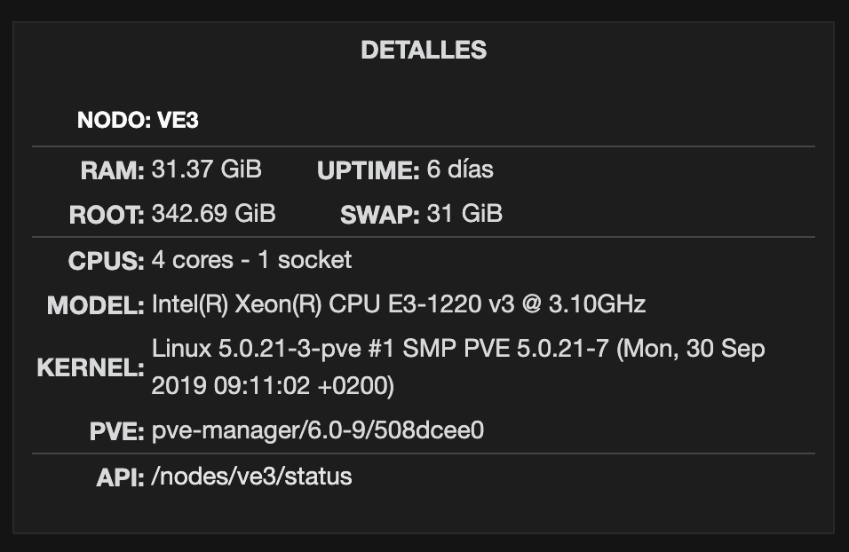
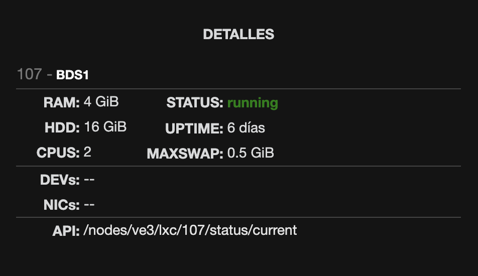

# Proxmox API Client
Cliente Simple en PHP para extraer datos de la API de proxmox de manera segura y enviarlos al navegador formateados como JSON.
Su uso principal es en paneles de información de Grafana.
Se incluyen un par de snippets para panel tipo html de grafana.
Solo permite peticiones GET a la API de Proxmox usando la librería https://github.com/Saleh7/ProxmoxVE_PHP_API

## Instalación 
Para instalar, clonar el repositorio a una carpeta en el servidor web con php e instalar las dependencias:
```sh
git clone https://github.com/aurexs/proxmox-api
cd proxmox-api
composer install --optimize-autoloader
cp config.php.sample config.php
```

## Configuración
Para que el cliente pueda funcionar, es necesario crear un usuario de solo lectura (rol `PVEAuditor`) en proxmox.
Ajustar parámetros de configuración en el archivo `config.php`, para más información consultar la documentación de la ProxmoxVE PHP API https://github.com/Saleh7/ProxmoxVE_PHP_API#usage.

## Grafana
Se incluye un ejemplo para consumir y mostrar los detalles de un nodo PVE en un panel de grafana usando Ajax. Para ello, en grafana se debe crear en templanting, una variable `$NODO` que contenga el id del nodo a mostrar, este ID debe coincidir con una configuración de nodo en el archivo `config.php` que es también el ID del nodo en PVE (ej: pve1).


En un dashboard de Grafana, crear un panel tipo html y pegar ahí el código del snippet [snippet-grafana-nodo.html](samples/snippet-grafana-nodo.html) por ejemplo.
En el snippet, modificar `PVE_API = "https://domain.uan.mx/proxmox-api/?n=__NODO__&r="` con la url del proyecto.
Después solo ajustar estilos y datos a mostrar en el panel.

## Ejemplos
Detalles de un nodo


Detalles de un contenedor LXC
